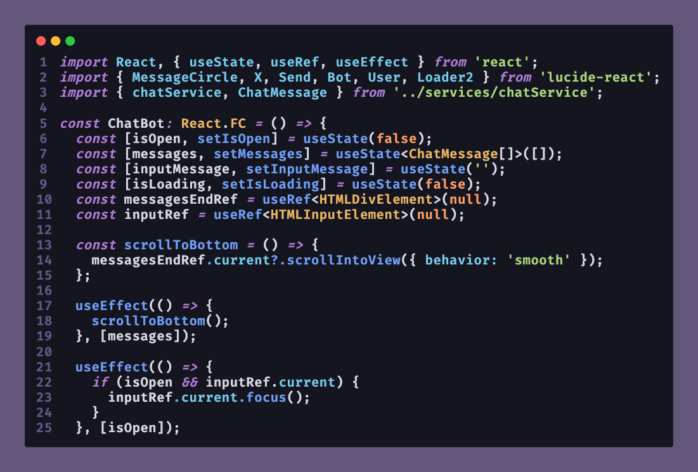

# Vision Night

A professional VS Code theme meticulously crafted for high readability, eye strain reduction, and accessibility. Based on the Tokyo Night aesthetic but refined for developers with myopia and long-session fatigue.



## 🧠 The Philosophy: "Soft Sharpness"

Most dark themes fail by using pure black backgrounds (#000000) and pure white text (#FFFFFF), creating a "halo effect" that causes extreme eye fatigue for people with myopia or astigmatism. 

**Vision Night** solves this by applying the **60/30/10 Rule**:
- **60% Deep Background (#151520)**: A midnight blue that absorbs light without being pitch black.
- **30% Syntax Base (#D5D6E1)**: Bluish-white text that is sharp but soft on the retina.
- **10% Highlight Colors**: Desaturated pasteles that highlight logic without deslumbrating.

## ✨ Key Features

- **Accessibility First**: Meets WCAG AA/AAA contrast standards.
- **Myopia Friendly**: Neutralized structural punctuation (brackets, tags) to keep the focus on the code that matters.
- **Unified UI**: Sidebar, Activity Bar, and Editor share a harmonious depth to prevent constant eye refocusing.
- **Multi-Language Support**: Optimized for React (TSX), TypeScript, Vue, Angular, Tailwind, PHP, and Modern JS.

## 🎨 Color Palette

| Element | Hex | Role |
| :--- | :--- | :--- |
| **Background** | `#151520` | Core surface (60%) |
| **Foreground** | `#D5D6E1` | Primary text (30%) |
| **Selection** | `#2F3C63` | Active selection |
| **Comments** | `#6A7191` | Muted documentation |
| **Functions** | `#6F9EF5` | Logic and methods |
| **Keywords** | `#B07CD6` | Control flow |
| **Strings** | `#A9D67A` | Text literals |
| **Types** | `#E8B463` | Classes and interfaces |
| **Variables** | `#74C9E8` | Props and attributes |
| **Errors** | `#FF6B7D` | Critical feedback |
| **Tags** | `#E96A75` | HTML/JSX elements |

## 🛠 Installation

1. Open **Extensions** sidebar panel in VS Code. `View → Extensions`.
2. Search for `Vision Night`.
3. Click **Install**.
4. Click **Set Color Theme**.

## 🎨 Customization

If you want to tweak something, you can add this to your `settings.json`:

```json
"workbench.colorCustomizations": {
    "[Vision Night]": {
        "editor.background": "#151520"
    }
}
```

## 📄 License

This project is licensed under the [MIT License](LICENSE).

---
Crafted with ❤️ by **Anthuan Vasquez**
