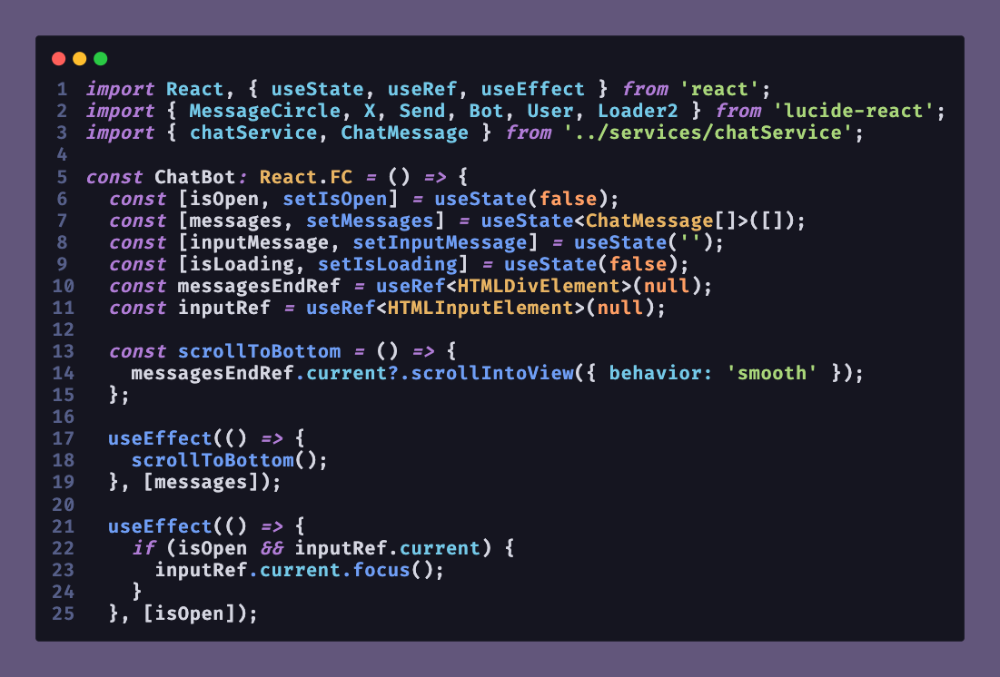

# Vision Night

A professional VS Code theme crafted for high readability, reduced visual noise, and accessible contrast. Based on the Tokyo Night aesthetic and tuned for long coding sessions.



## The Philosophy: "Soft Sharpness"

Pure black backgrounds (#000000) and pure white text (#FFFFFF) can create harsh perceived glare for some developers during long sessions.

**Vision Night** applies the **60/30/10 Rule** to help reduce that effect:
- **60% Deep Background (#151520)**: A midnight blue that absorbs light without being pitch black.
- **30% Syntax Base (#D5D6E1)**: Bluish-white text that is sharp but soft on the retina.
- **10% Highlight Colors**: Desaturated pasteles that highlight logic without deslumbrating.

## Key Features

- **Accessible Contrast**: Core text meets WCAG AAA; documented syntax tokens meet WCAG AA on both editor canvases.
- **Reduced Visual Noise**: Structural punctuation and tag delimiters are neutralized to keep focus on the code that matters.
- **Unified UI**: Sidebar, Activity Bar, and Editor share a harmonious depth to prevent constant eye refocusing.
- **Broad Syntax Compatibility**: Clean, essential token coverage for modern JavaScript, TypeScript, TSX, Vue, Python, PHP, CSS, and Markdown without visual clutter.

## 🌗 Theme Variants

Vision Night includes two dark variants calibrated for different ambient lighting conditions:

| Variant | Editor Canvas | Base Chrome | Recommended Lighting |
| :--- | :--- | :--- | :--- |
| **Vision Night (Default)** | `#1A1A26` | `#151520` | **Night & low-light**: Deep background helps reduce perceived glare. |
| **Vision Night Storm** | `#222436` | `#1B1C2A` | **Daytime & well-lit rooms**: A lighter canvas reduces the perceived contrast with a bright environment. |

## 🎨 Color Palette

| Element | Hex | Role | Contrast (Default / Storm) |
| :--- | :--- | :--- | :--- |
| **Canvas Base** | `#151520` / `#1B1C2A` | Sidebar, activity bar, and window chrome | — |
| **Editor Canvas** | `#1A1A26` / `#222436` | Main editor and terminal surface | — |
| **Line Highlight** | `#212130` / `#292C42` | Active line depth cue (subtly elevated) | — |
| **Surface** | `#1E1E28` / `#272A3E` | Widgets, popups, inputs, and dropdowns | — |
| **Border** | `#2A2F46` / `#323753` | Structural separation and container edges | — |
| **Foreground** | `#D5D6E1` | Primary text (WCAG AAA) | `11.92:1` / `10.58:1` |
| **Secondary / Operators** | `#A9ADC1` | Operators, delimiters, and tag brackets | `7.74:1` / `6.87:1` |
| **Selection** | `#2F3C63` / `#364470` | Active selection and match highlights | — |
| **Comments** | `#828BAE` | Readable documentation (WCAG AA) | `5.13:1` / `4.55:1` |
| **Functions** | `#6F9EF5` | Methods and executable logic | `6.47:1` / `5.74:1` |
| **Keywords** | `#B07CD6` | Control flow and storage modifiers | `5.49:1` / `4.88:1` |
| **Strings** | `#A9D67A` | Text literals and templates | `10.32:1` / `9.16:1` |
| **Types** | `#E8B463` | Classes, types, and interfaces | `9.13:1` / `8.11:1` |
| **Variables / Props** | `#74C9E8` | Variables, properties, and attributes | `9.23:1` / `8.20:1` |
| **Constants** | `#C89A6A` | Numbers, booleans, and enum members | `6.79:1` / `6.03:1` |
| **Tags** | `#D47D8A` | HTML/JSX elements | `5.82:1` / `5.17:1` |
| **Errors** | `#FF6B7D` | Diagnostics and critical alerts | `6.27:1` / `5.57:1` |

## UI Hierarchy

Vision Night applies a disciplined depth hierarchy so VS Code feels unified without visual fatigue:

- **Base canvas `#151520`** for the activity bar, sidebar, and status bar.
- **Editor plane `#1A1A26`** for code focus and terminal continuity.
- **Active tab `#1A1A26`** seamlessly connects to the editor without distracting seams.
- **Elevated surface `#1E1E28`** for widgets, suggestion boxes, and inputs.
- **Line highlight `#212130`** gently defines the current line without creating a dark pit.
- **Structural edge `#2A2F46`** for container definition and borders.
- **Interactive accent `#2F3C63`** for selections and active focus.

This keeps the editor as the visual anchor, closer to the Tokyo Night balance, while preserving the original “Soft Sharpness” philosophy.

## Testing The Theme

To preview changes locally:

1. Press `F5` in this workspace.
2. In the new **Extension Development Host** window, open **Preferences: Color Theme**.
3. Select **Vision Night** or **Vision Night Storm**.
4. Open the Explorer, a Markdown file, and the integrated terminal to review the hierarchy.
5. After editing the theme file, run **Developer: Reload Window** in that host window.

For precise token inspection, use **Developer: Inspect Editor Tokens and Scopes**.

## Installation

1. Open **Extensions** sidebar panel in VS Code. `View → Extensions`.
2. Search for `Vision Night`.
3. Click **Install**.
4. Click **Set Color Theme**.

## Recommended Setup & Settings

For a more comfortable, accessible setup during long sessions, pair Vision Night with the following configuration:

### 1. Recommended Icon Theme: Catppuccin Icons
Standard icon packs often use oversaturated, primary colors that turn the file explorer into a high-contrast rainbow, forcing your eyes to constantly refocus. **Catppuccin Icons (Macchiato or Mocha flavor)** uses soft, muted pastel tones that harmonize with Vision Night's palette without visual clutter.

1. Install **Catppuccin Icons for VSCode** from the Extensions marketplace.
2. Enable it in your `settings.json`:
   ```json
   "workbench.iconTheme": "catppuccin-macchiato"
   ```

### 2. Recommended Accessibility Settings
Add these recommended settings to your `settings.json` to optimize typography and ocular rhythm:

```json
{
  // Highly legible typography with generous x-height
  "editor.fontFamily": "'JetBrains Mono', 'Cascadia Code', monospace",

  // Slightly elevated weight prevents glyphs from feeling thin and blurry
  "editor.fontWeight": "450",

  // Comfortable line spacing reduces line-tracking effort
  "editor.lineHeight": 1.6,

  // Fluid cursor reduces abrupt visual flickers
  "editor.cursorBlinking": "smooth",
  "editor.cursorSmoothCaretAnimation": "on",

  // Clear structural tracking
  "editor.bracketPairColorization.enabled": true,
  "editor.guides.bracketPairs": "active"
}
```

### 3. Recommended Indentation Guides: Indent Rainbow
For a subtle visual guide in deeply nested code, configure [Indent Rainbow](https://marketplace.visualstudio.com/items?itemName=oderwat.indent-rainbow) to use thin lines drawn from the Vision Night syntax palette:

```json
{
  "indentRainbow.indicatorStyle": "light",
  "indentRainbow.lightIndicatorStyleLineWidth": 1,
  "indentRainbow.colors": [
    "rgba(111, 158, 245, 0.28)",
    "rgba(176, 124, 214, 0.26)",
    "rgba(169, 214, 122, 0.26)",
    "rgba(232, 180, 99, 0.26)"
  ],
  "indentRainbow.errorColor": "rgba(255, 107, 125, 0.60)",
  "indentRainbow.tabmixColor": "rgba(212, 125, 138, 0.55)"
}
```

## Customization

You can easily tweak any color in Vision Night without editing the extension files directly. Open your VS Code `settings.json` (`Cmd + Shift + P` / `Ctrl + Shift + P` → `Preferences: Open User Settings (JSON)`) and add your overrides scoped to `[Vision Night]`:

### Overriding UI / Workbench Colors
To tweak UI elements such as the background, line highlight, or sidebar:

```json
"workbench.colorCustomizations": {
  "[Vision Night]": {
    // Example: make the editor background slightly darker or lighter
    "editor.background": "#151520",

    // Example: change active line highlight border
    "editor.lineHighlightBorder": "#2A2F46",

    // Example: adjust sidebar color
    "sideBar.background": "#101017"
  }
}
```

### Overriding Syntax / Token Colors
To tweak syntax elements like comments, keywords, or variables:

```json
"editor.tokenColorCustomizations": {
  "[Vision Night]": {
    "comments": "#A9ADC1",         // Make comments even brighter
    "keywords": "#C678DD",         // Customize keyword tone
    "functions": "#7AA2F7",        // Alternate blue for function calls
    "strings": "#98C379",          // Custom string literal color
    "textMateRules": [
      {
        "scope": "comment",
        "settings": {
          "fontStyle": ""          // Disable italics for comments if preferred
        }
      }
    ]
  }
}
```

## License

This project is licensed under the [MIT License](LICENSE).

---
Crafted with ❤️ by **Anthuan Vasquez**
